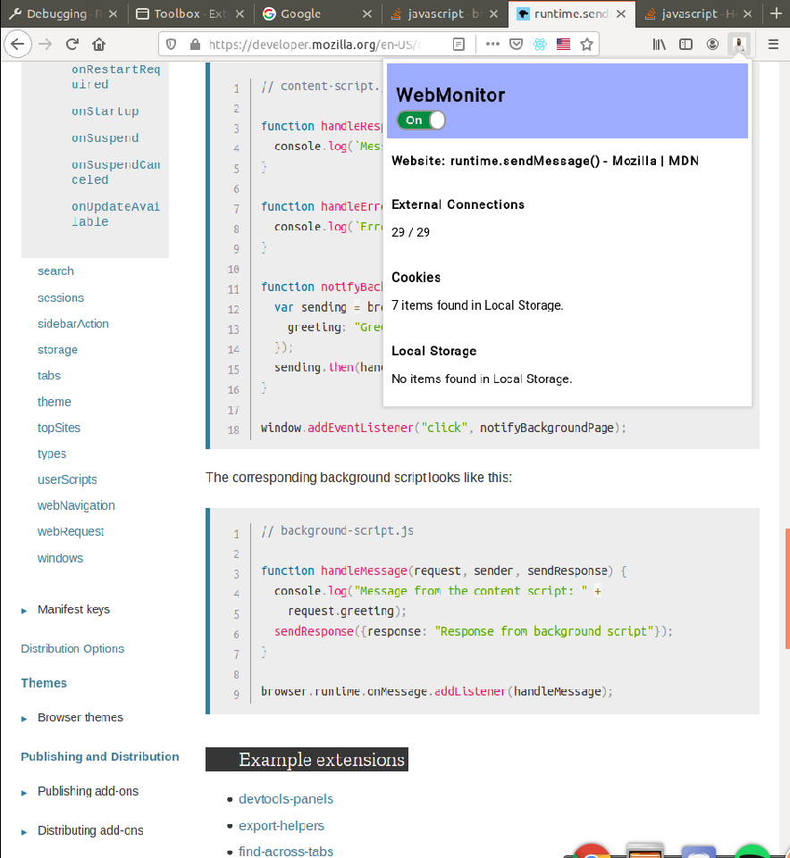

# WebMonitor

Simple Firefox extension used to track Cookies, external connections and local storage.

DISCLAIMER: this was not tested on other browsers, only Mozilla Firefox.

## Example

  

## How to Install

Click [here](https://developer.mozilla.org/en-US/docs/Mozilla/Add-ons/WebExtensions/Your_first_WebExtension#Installing) to understand how to install the extension manually.